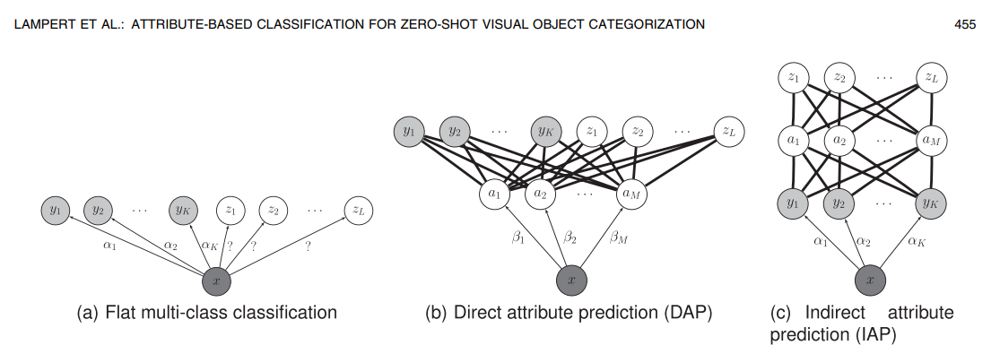
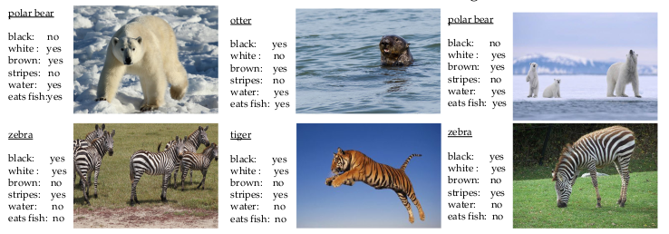

# Zero Shot Learning (ZSL)

## Definitions. 

**Zero-shot learning** is a learning method that *aims to recognize objects whose instances may not have been seen during [training](https://arxiv.org/pdf/1707.00600.pdf)*
**Source labels**. It is the labeled train data to learn the classifier.
**Target labels** are labels that classification is desired.
Target and Source data does not crossing.

## ZSL classifications
ZSL is subdivided: 
1) [by test conditions](https://arxiv.org/pdf/1803.11320.pdf): 
   a) Zero short learning (It has the strong assumption that there are no source(training) classes at test time)
   b) Generalized Zero short learning (no suggestions about test time stage).
2) [by train conditions](https://arxiv.org/pdf/1803.11320.pdf):
   a) inductive (target data are not available during training time)
   b) transductive (both the labeled source data and the unlabeled target data are available for training)

## Methods
The main problem of zsl - target and source domain difference. The networks cannot adequately predict the objects of unseen (in training) classes. That's why researchers come to the idea of the train data intermediate representation, that can be applied to any data. So the target idea is to learn the projection function from image to some intermediate space, where each group of objects has its unique representation. The first idea was the attributes vector.
### Attributes approach
First studies in zsl applies to find the relationships between source and target labels through unique set of attributes that any object has.

*some baseline architectures used in attributes 
approach to find the relations between attributes, target and source data*

Where the y1 .. yk is source labels, z1 .. zL - target labels, 
a1 .. aM set of attributes.
For an object the attributes a1 .. aM - is one hot vector. 

*attributes example*

There is variety of different methods to find attributes: from attribute binary classification
to probablistic methods for each attribute. 

### Semantic embedding space
Attributes approach is a special case of embedding space. Semantic embedding approach ideas is developed
in recent years. 
[DEVISE](https://static.googleusercontent.com/media/research.google.com/ru//pubs/archive/41473.pdf) 
propose to use word2vec embeddings of class names as class embedding. 
[SSE](https://arxiv.org/abs/1509.04767) (semantic similarity embedding) autors offer to learn projection
from train image to semantic embedding space and search unseen classes as mixture of seen classes. 
[ESZSL](https://www.robots.ox.ac.uk/~tvg/publications/2015/romera-paredes15.pdf) 
introduce loss regularization technique to smooth Embedding space for similar objects and thinn for different. 

### Keep calm and Stack
[SYNC](https://arxiv.org/abs/1603.00550) uses linear combination of pre-trained classifiers 
on source data to get an embedding (and label) of target data classes.

### Learning Techniques
QFSL (Quasi-Fully Supervised Learning)